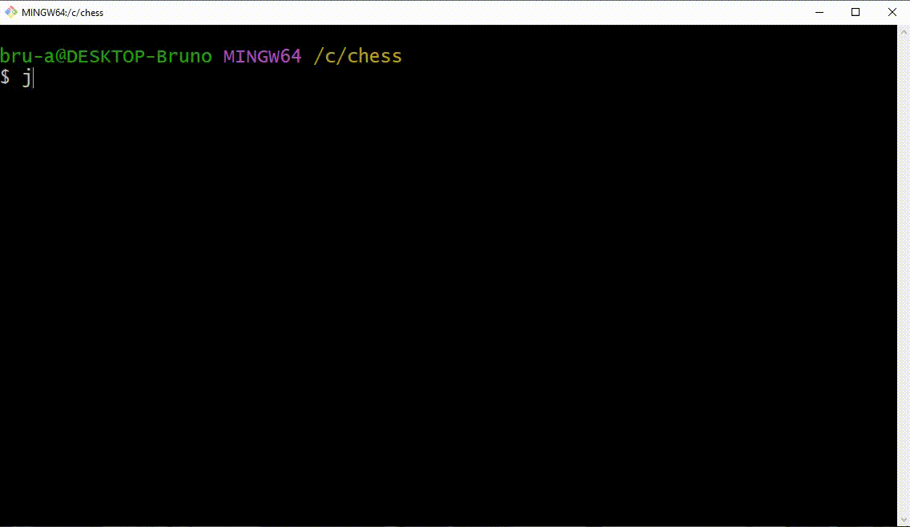

<h1 align="center"> Sistema de xadrez em Java  Java Chess System</h1>

 Projeto desenvolvido durante o curso do Prof. Dr. Nélio Alves.

 
 
 

# Funções

- Sistema bilingue (inglês e português)

- Verifica e exibe todas as movimentações possíveis da peça selecionada

- Armazena e exibe todas as peças capturadas por ambos jogadores

- Implementação jogadas especiais, tais como: Roque, En Passant e Promoção

- Sistema que detecta Cheque e Chequemate

- Contagem do número total de jogadas

 
 

# Peças

- R: Rei
- D: Dama (Rainha)
- B: Bispo
- C: Cavalo
- T: Torre
- P: Peão